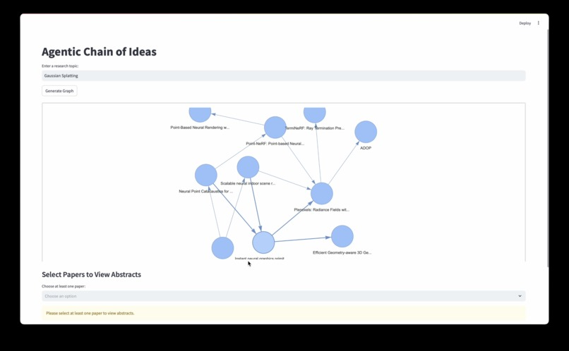
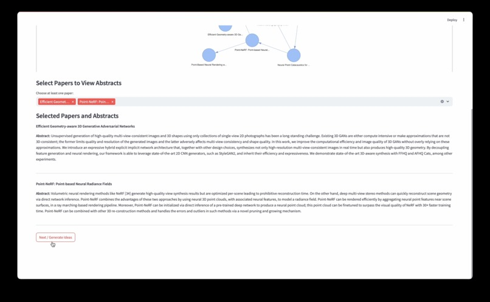
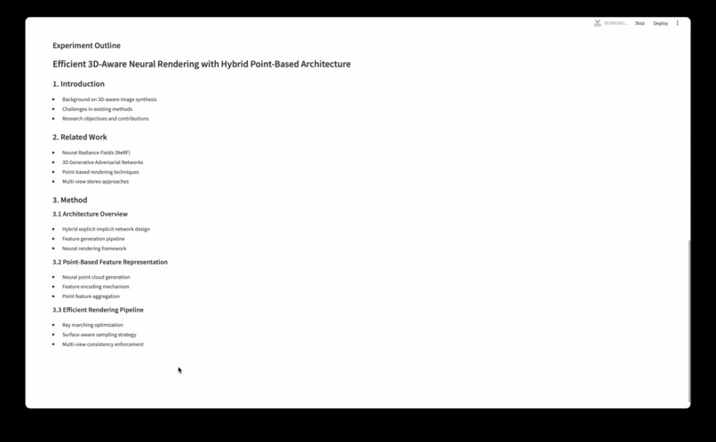
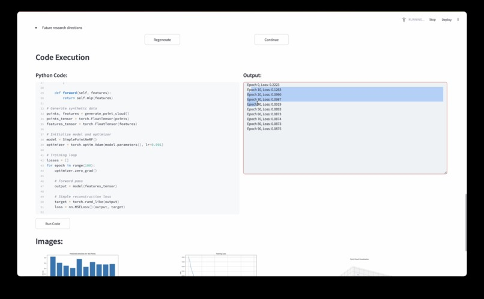
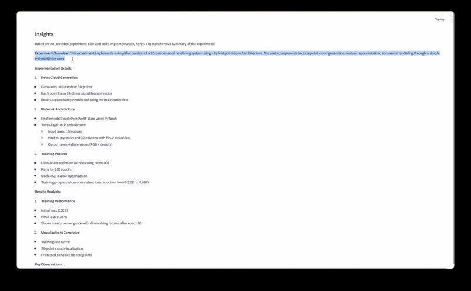

# AcAi (Academic AI)

AcAi (Academic AI) is an advanced tool designed to assist researchers and academics in generating, analyzing, and visualizing research papers and their citations. By leveraging state-of-the-art AI models and citation network analysis, AcAi aims to enhance the research process, enabling users to generate hypotheses, outline experiments, execute code, and compile research reports efficiently.

## Inspiration

PhD-level intelligence does not equate to PhD-level utility. Companies hire PhDs to conduct research, not to answer examination questions. The next frontier for AI—and AGI—is agentic research. We hypothesize the knowledge discovery process and develop a framework for LLMs to pursue autonomous science, potentially scaling research-first organizations exponentially and transforming every researcher into a 10x researcher.

## Features

- **Knowledge Graph Generation**: Automatically generate a citation graph for a given research topic using Semantic Scholar data.
- **Experiment Outline Generation**: Create an experimental outline based on selected research papers.
- **Code Execution**: Generate, edit, and execute Python code snippets based on experiment plans.
- **Research Report Generation**: Summarize the experimental results, insights, and conclusions in Markdown format.

## How It Works

### 1. Knowledge Graph Construction
We hypothesize that science is built upon interpolating ideas—chains of ideas—manifesting in 'hedgehog' and 'foxy' paradigms (interpolating between and within fields). AcAi mines the most relevant research papers from Semantic Scholar and constructs a **Knowledge Graph** of citations. The depth of this graph is adjustable, allowing users to explore deeper layers of citations.

Users can refine and emphasize specific papers that are more relevant than those automatically suggested by Semantic Scholar. This graph is then used as context, along with research papers, to guide AI-driven hypothesis generation.

### 2. Hypothesis and Experiment Generation
To mitigate AI hallucination, we integrate **Retrieval-Augmented Generation (RAG)** with Knowledge Graphs to improve grounding. Although we use Claude 3.5-Sonnet due to resource constraints, our backend is modular and can support other LLMs. The AI follows a **Chain-of-Thought (CoT) reasoning** approach to systematically generate hypotheses and experimental plans.

### 3. Code Execution and Result Analysis
Once a user approves the experiment plan, AcAi generates Python code to execute the experiment. An inline code editor allows modifications before execution on the user's local compute. The results are then visualized and analyzed.

### 4. Research Report Compilation
Experimental results are compiled into a structured **Markdown research report**, summarizing insights, methodologies, and conclusions.

## Technologies Used

- **Python**: Backend development and data processing.
- **Streamlit**: Web-based UI framework for interactivity.
- **NetworkX**: Construction and analysis of citation graphs.
- **PyVis**: Interactive visualization of citation networks.
- **Matplotlib**: Plot generation for experimental results.
- **Requests**: API calls to external services like Semantic Scholar.
- **Claude 3.5-Sonnet**: AI model for research analysis and hypothesis generation.

## Installation & Usage

### Installation

Clone the repository and navigate to the project folder:

```sh
git clone https://github.com/SamuelKhoo2003/AcAi.git
cd AcAi
```

Install dependencies:

```sh
pip install -r requirements.txt
```

### Running the Application

```sh
streamlit run App/frontend/app.py
```

## Images & Demos

Below are some visuals demonstrating AcAi’s features:

### Images






### Demo Video
<video width="700" controls>
    <source src="Extras/readme_resources/demo.mp4" type="video/mp4">
    Your browser does not support the video tag.
</video>


## Challenges & Learnings

- **Challenges**: Initially, we attempted to use Claude’s Computer Use API, but it proved inefficient for our needs. Instead, we developed an alternative approach for executing experiments.
- **Achievements**: AcAi has successfully assisted in research topics like Deterministic Concurrency, Continual Learning, Hardware Security, and Underwater Computer Vision.
- **Key Learning**: AGI may not be too far off, and never commit API keys to GitHub!

## Future Plans

1. **Scalability**: Expand the Knowledge Graph to support multiple research graphs, enabling large-scale interpolation of ideas.
2. **Markov Reward Strategy**: Treat hypothesis selection as a **Markov Decision Process (MDP)** and implement **Multi-Armed Bandit** strategies to refine hypothesis selection continuously.

## Contributing

Contributions are welcome! Please open an issue or submit a pull request for any improvements or bug fixes.

## License

This project is licensed under the MIT License. See the LICENSE file for details.

---

AcAi is built to empower researchers, transforming the way scientific discovery is conducted through AI-driven automation and augmentation. Join us in shaping the future of autonomous research!

